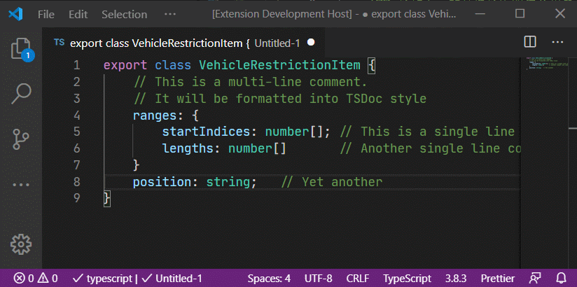

# TSDoc Comment

A VSCode extension for converting simple C/C++ style comments into TSDoc style comments

## Features

Convert:

```ts
// This is a multi-line comment
// And will be converted into
// TSDoc style comment
name: string;
age: number; // this a single line comment
```

Into:

```ts
/** This is a multi-line comment
 * And will be converted into
 * TSDoc style comment
 */
name: string;
/** this a single line comment */
age: number;
```



## How to Use

1. Select a block of text
2. Press Ctrl+Shift+P. Select `TSDoc Comment: convert selected text into TSDoc style comment`

## License

MIT.

## Resource code

https://github.com/kingsimba/vscode-tsdoc-comment

## Release Notes

### 1.0.0

- First release.
